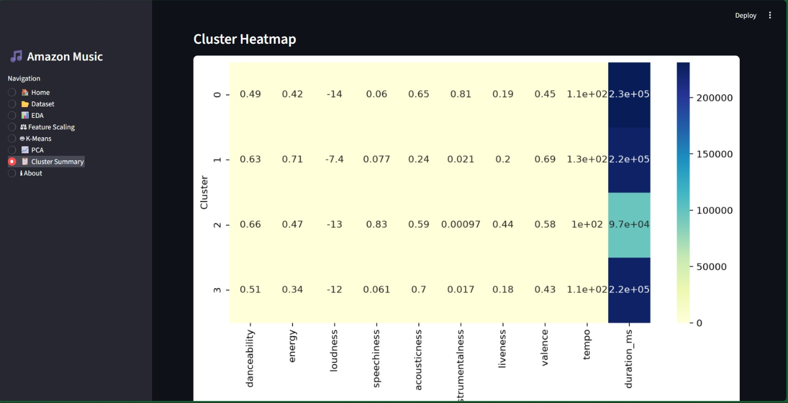
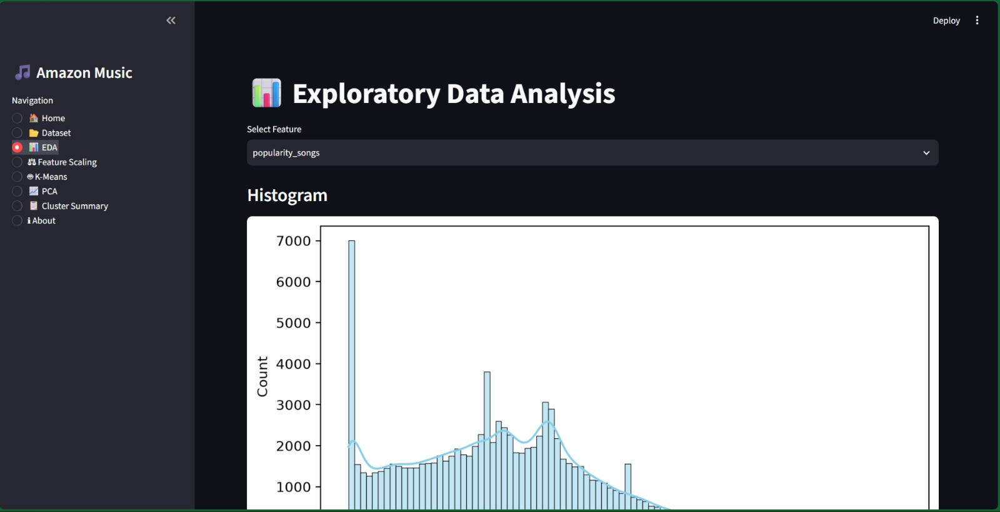
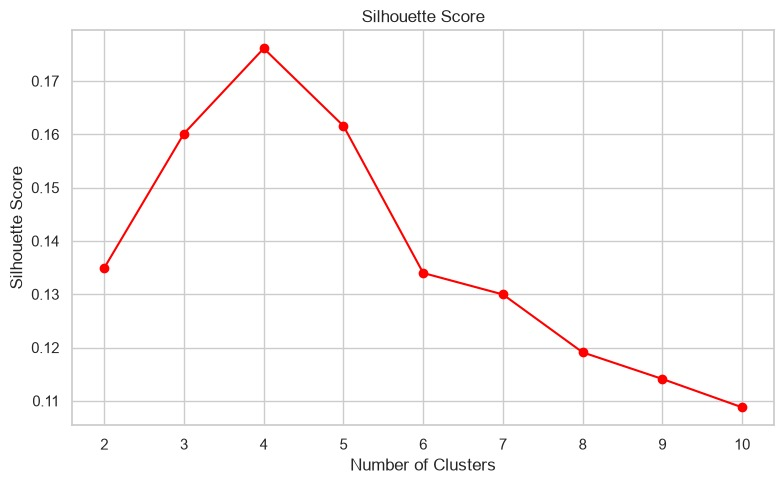
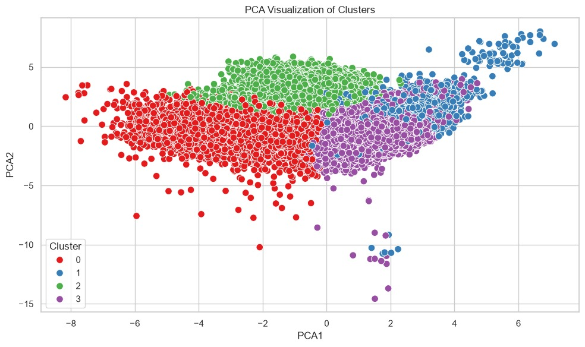
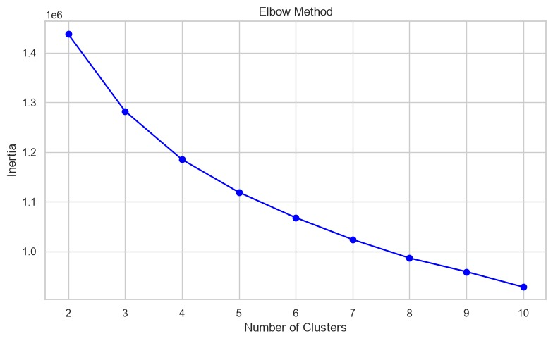

# 🎵 Amazon Music Clustering using K-Means 🎧🤖

An **AI-powered Music Clustering** project that leverages **K-Means Clustering** to intelligently group Amazon Music tracks based on their audio characteristics. The project includes Exploratory Data Analysis (EDA), PCA visualization, cluster evaluation, and interactive visualizations for better insights.

---

# ✨ Project Highlights

✅ Exploratory Data Analysis (EDA)  
✅ Data Preprocessing & Feature Scaling  
✅ K-Means Clustering Algorithm  
✅ Optimal Cluster Selection using Elbow Method  
✅ PCA for 2D Cluster Visualization  
✅ Cluster Performance Evaluation  
✅ Interactive Data Visualizations

---

# 🛠️ Technologies Used

- 🐍 Python
- 📊 Pandas
- 🔢 NumPy
- 📈 Matplotlib
- 📉 Seaborn
- 🤖 Scikit-learn
- 📊 Plotly
- 📓 Jupyter Notebook

---

# 📂 Project Workflow

1️⃣ Load Amazon Music Dataset

2️⃣ Perform Exploratory Data Analysis (EDA)

3️⃣ Handle Missing Values & Data Cleaning

4️⃣ Scale Numerical Features

5️⃣ Determine Optimal Clusters using Elbow Method

6️⃣ Train K-Means Clustering Model

7️⃣ Reduce Dimensions using PCA

8️⃣ Visualize Clusters

9️⃣ Evaluate Clustering Performance

---

# 📸 Project Screenshots

## 📊 Data Visualization



---

## 🔍 Exploratory Data Analysis (EDA)



---

## 📈 Clustering Performance Score



---

## 📉 PCA Cluster Visualization



---

## 📐 Elbow Method



---

# 🤖 Machine Learning Model

### Algorithm Used

- ✅ K-Means Clustering

### Dimensionality Reduction

- ✅ Principal Component Analysis (PCA)

---

# 📊 Model Evaluation

The clustering model is evaluated using:

- 📌 Inertia Score
- 📌 Elbow Method
- 📌 Cluster Distribution
- 📌 PCA Visualization

---

# 🚀 Features

- 🎵 Intelligent Music Segmentation
- 📊 Exploratory Data Analysis
- 📈 Interactive Visualizations
- 📉 Optimal Cluster Detection
- 🎯 PCA-Based Cluster Projection
- 🤖 Unsupervised Machine Learning
- 📚 Well-Structured Workflow

---

# 📁 Project Structure

```text
Amazon-Music-Clustering/
│
├── Amazon_Music_Clustering.ipynb
├── requirements.txt
├── README.md
├── dataset/
├── screenshots/
│   ├── the_chart.jpeg
│   ├── eda.jpeg
│   ├── score.jpeg
│   ├── pca.jpeg
│   └── elbow.jpeg
```

---

# ▶️ How to Run

### Clone the Repository

```bash
git clone https://github.com/yourusername/Amazon-Music-Clustering.git
```

### Install Dependencies

```bash
pip install -r requirements.txt
```

### Launch the Notebook

```bash
jupyter notebook
```

Open **Amazon_Music_Clustering.ipynb** and run all cells.

---

# 🎯 Future Enhancements

- 🎼 Music Recommendation System
- 🤖 DBSCAN & Hierarchical Clustering Comparison
- 📈 Interactive Dashboard
- 🎵 Genre-Based Recommendation Engine
- 🌐 Streamlit Deployment

---

# 👨‍💻 Author

**Logamithran BS**

📧 AI & Machine Learning Enthusiast  
🚀 Passionate about Machine Learning, Data Science & Intelligent Analytics

---

## ⭐ If you found this project helpful, don't forget to ⭐ Star the repository!
